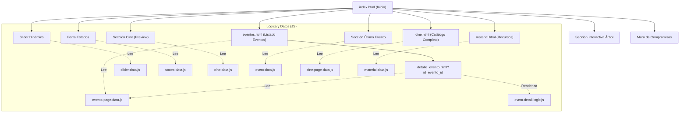

# Documentación del Sitio Web: Integridad desde la Raíz

Este documento contiene las especificaciones técnicas para la solicitud de contenidos, el mapa del sitio actual y la propuesta de estructura para la futura base de datos.

---

## 1. Requerimientos de Contenido para Creadores

Utilice esta guía para solicitar información a los equipos de comunicación y diseño. Respetar los límites de caracteres y formatos asegura que el diseño se mantenga consistente.

### A. Página de Inicio - Slider Principal (Carrusel)
*Imágenes de gran impacto para la bienvenida.*

| Campo | Tipo | Requisito / Límite | Descripción |
| :--- | :--- | :--- | :--- |
| **Tipo de Slide** | Selección | `Simple` (Imagen sola) o `Complejo` (Texto + Imagen) | Define el diseño del banner. |
| **Título** | Texto (HTML) | Máx. 60 caracteres | Puede incluir etiquetas `` para colores destacados. |
| **Descripción** | Texto | Máx. 120 caracteres | Subtítulo breve y llamativo. |
| **Imagen de Fondo** | Imagen | **1920x1080px** (Landscape) | JPG/WebP optimizado (Máx 300KB). |
| **Botón (Texto)** | Texto | Máx. 15 caracteres | Ej: "Ver Video", "Conocer Más". |
| **Botón (Enlace)** | URL | Enlace interno (`#seccion`) o externo | A dónde lleva el clic. |

### B. Sección de Estados (Logos y Redes)
*Barra de navegación por regiones.*

| Campo | Tipo | Requisito / Límite | Descripción |
| :--- | :--- | :--- | :--- |
| **Nombre Estado** | Texto | Máx. 15 caracteres | Nombre corto (Ej: "Puebla", "CDMX"). |
| **Logo** | Imagen | **400x200px** (aprox) | **PNG Transparente** obligatorio. Fondo blanco/transparente. |
| **Enlace Sitio** | URL | URL completa | Sitio web oficial del estado. |
| **Redes Sociales** | Lista | URL + Tipo | Facebook, X (Twitter), Instagram, TikTok, YouTube. |

### C. Cine de la Integridad (Videos)
*Galería de videos de YouTube filtrable por estado.*

En el proyecto hay **dos “capas”** de Cine:
1. **Inicio (index.html) / Vista previa por estado**: tarjetas por estado con video local (`.mp4`) y poster (`.jpeg`) desde [cine-data.js](file:///c:/xampp/htdocs/IntegridadesDeLaRaiz/js/cine-data.js) renderizado por [cine-logic.js](file:///c:/xampp/htdocs/IntegridadesDeLaRaiz/js/cine-logic.js).
2. **Página Cine (cine.html) / Catálogo por estado**: listado de videos (YouTube) con filtros desde [cine-page-data.js](file:///c:/xampp/htdocs/IntegridadesDeLaRaiz/js/cine-page-data.js) renderizado por [cine-page-logic.js](file:///c:/xampp/htdocs/IntegridadesDeLaRaiz/js/cine-page-logic.js).

La siguiente tabla une **todos los campos** que aparecen en ambas capas (algunos son opcionales según dónde se usen):

| Campo (unificado) | Tipo | Requisito / Límite | Se usa en | Fuente actual | Descripción / Notas |
| :--- | :--- | :--- | :--- | :--- | :--- |
| **estado_slug** | Texto | `sin-espacios-minusculas` | Inicio + Cine | cine-data.js / cine-page-data.js | Identificador para filtrar y construir URLs (ej: `puebla`). En cine-page-data.js hoy se llama `state`. |
| **estado_nombre_corto** | Texto | Máx. 15 caracteres | Inicio | cine-data.js | Nombre en tarjeta (ej: `PUEBLA`). En cine-data.js hoy se llama `name`. |
| **estado_slogan** | Texto | Máx. 60 caracteres | Inicio | cine-data.js | Frase corta bajo el nombre. En cine-data.js hoy se llama `slogan`. |
| **estado_titulo_color_class** | Texto | Clase Tailwind | Inicio | cine-data.js | Clase opcional para color de título (ej: `text-green-900`). En cine-data.js hoy se llama `titleColorClass`. |
| **preview_video_src** | URL / Ruta | `.mp4` | Inicio | cine-data.js | Video local mostrado en la tarjeta. En cine-data.js hoy se llama `videoSrc`. |
| **preview_poster_src** | URL / Ruta | `.jpg/.jpeg/.png` | Inicio | cine-data.js | Poster del video local. En cine-data.js hoy se llama `posterSrc`. |
| **cta_url** | URL / Ruta | Interno recomendado | Inicio | cine-data.js | A dónde navega la tarjeta (ej: `cine.html?estado=puebla`). En cine-data.js hoy se llama `url`. |
| **youtube_id** | Texto | 11 caracteres | Cine | cine-page-data.js | ID de YouTube (ej: `V8Hvr99LLFk`). En cine-page-data.js hoy se llama `id`. |
| **video_titulo** | Texto | Máx. 50 caracteres | Cine | cine-page-data.js | Título visible del video. En cine-page-data.js hoy se llama `title`. |
| **video_descripcion** | Texto | Máx. 150–200 caracteres | Cine | cine-page-data.js | Sinopsis. En cine-page-data.js hoy se llama `description`. |
| **estado_label** | Texto | Máx. 15 caracteres | Cine | cine-page-data.js | Label humano para el badge (ej: `Puebla`). En cine-page-data.js hoy se llama `stateLabel`. |
| **estado_badge_class** | Texto | Clase Tailwind | Cine | cine-page-data.js | Clase para color del badge (ej: `bg-green-500/80`). En cine-page-data.js hoy se llama `badgeClass`. |
| **hashtag** | Texto | Máx. 30 caracteres | Cine | cine-page-data.js | Se muestra como etiqueta debajo de la descripción. En cine-page-data.js hoy se llama `hashtag`. |
| **filtro_id** | Texto | `todos` o `estado_slug` | Cine | cine-page-data.js | Campo usado en `filtersData` (`id`). Se recomienda que coincida con `estado_slug`. |
| **filtro_label** | Texto | Máx. 15 caracteres | Cine | cine-page-data.js | Campo usado en `filtersData` (`label`). |

Relación recomendada (futuro admin / DB):
- **estados (1) -> cine_estados (1)**: configuración de la tarjeta del Inicio por estado (video local + poster + slogan).
- **estados (1) -> videos_cine (N)**: múltiples videos YouTube asociados a un estado.

### D. Eventos (Listado y Detalle)
*Información completa de actividades.*

En el proyecto hay **dos fuentes** de datos para eventos:
1. **Inicio (index.html) / Sección “Último Evento”**: usa [event-data.js](file:///c:/xampp/htdocs/IntegridadesDeLaRaiz/js/event-data.js) (lista `eventsList`) renderizado por [event-logic.js](file:///c:/xampp/htdocs/IntegridadesDeLaRaiz/js/event-logic.js).
2. **eventos.html + detalle_evento.html**: usa [events-page-data.js](file:///c:/xampp/htdocs/IntegridadesDeLaRaiz/js/events-page-data.js) (lista `eventsPageData`) renderizado por [events-page-logic.js](file:///c:/xampp/htdocs/IntegridadesDeLaRaiz/js/events-page-logic.js) y [event-detail-logic.js](file:///c:/xampp/htdocs/IntegridadesDeLaRaiz/js/event-detail-logic.js).

La siguiente tabla une **todos los campos** que aparecen entre Inicio + Listado + Detalle:

| Campo (unificado) | Tipo | Requisito / Límite | Se usa en | Fuente actual | Descripción / Notas |
| :--- | :--- | :--- | :--- | :--- | :--- |
| **evento_id** | Texto | `sin-espacios-minusculas` | Inicio + Eventos + Detalle | event-data.js / events-page-data.js | Identificador único. Ej: `rally-puebla-2025`. |
| **visible** | Boolean | `true/false` | Inicio | event-data.js | Define qué evento se muestra en “Último Evento” (se toma el primer `visible: true`). |
| **badge** | Texto | Máx. 30 caracteres | Inicio | event-data.js | Etiqueta superior (ej: `Último Rally`). |
| **titulo_html** | Texto (HTML) | Máx. 60–80 caracteres | Inicio + Eventos + Detalle | event-data.js / events-page-data.js | Puede incluir `` para color. En event-data.js hoy `title`, en events-page-data.js hoy `title`. |
| **descripcion** | Texto | 150–800 caracteres | Inicio + Eventos + Detalle | event-data.js / events-page-data.js | Resumen / crónica corta. En el listado se recorta visualmente. |
| **fecha_texto** | Texto | Máx. 20 caracteres | Inicio + Eventos + Detalle | event-data.js / events-page-data.js | Ej: “Febrero 2025” (Inicio) o “25 Feb 2025” (Eventos). |
| **ubicacion** | Texto | Máx. 60 caracteres | Inicio + Eventos + Detalle | event-data.js / events-page-data.js | Lugar físico. En event-data.js hoy `location`. |
| **estado_nombre** | Texto | Máx. 15 caracteres | Eventos + Detalle | events-page-data.js | Para filtros y badge del listado (ej: `Puebla`). En events-page-data.js hoy `state`. (En Inicio actualmente no existe este campo). |
| **cta_url** | URL / Ruta | Interno recomendado | Inicio | event-data.js | Link del botón “Ver Detalles del Evento”. En event-data.js hoy `url`. Recomendación: `detalle_evento.html?id=<evento_id>` para que el detalle cargue el evento correcto. |
| **imagen_portada** | URL / Ruta | 1200x800px recomendado | Inicio + Eventos + Detalle | event-data.js / events-page-data.js | Imagen principal del evento. En Inicio hoy `mainImage`. En Eventos hoy `imageUrl`. |
| **decoracion_top_left** | URL / Ruta | PNG recomendado | Inicio | event-data.js | Decoración opcional. En event-data.js vive en `decorations.topLeft`. |
| **decoracion_bottom_right** | URL / Ruta | PNG recomendado | Inicio | event-data.js | Decoración opcional. En event-data.js vive en `decorations.bottomRight`. |
| **galeria_fotos** | Lista de URLs | 6–12 recomendado | Inicio + Detalle | event-data.js / events-page-data.js | Fotos usadas en galerías. En Inicio se muestran como carrusel horizontal; en Detalle se usa visor + thumbnails. |
| **pilares** | Lista texto | 1 palabra por pilar | Detalle | events-page-data.js | Valores del evento. En events-page-data.js hoy `pillars`. Si hay `banners`, el detalle prioriza `banners`. |
| **video_embed_url** | URL | URL embed YouTube | Detalle | events-page-data.js | URL tipo `https://www.youtube.com/embed/<id>`. En events-page-data.js hoy `videoUrl`. |
| **impacto_texto** | Texto | Máx. 30 caracteres | Detalle | events-page-data.js | Texto de impacto (ej: `200+ Personas`). En events-page-data.js hoy `impact`. |
| **pilares_count_texto** | Texto | Máx. 30 caracteres | Detalle | events-page-data.js | Texto corto para contador de valores (ej: `7 Pilares`). En events-page-data.js hoy `pillars_count`. |
| **banners_rollup** | Lista de URLs | Verticales recomendado | Detalle | events-page-data.js | Imágenes verticales de pilares físicos. En events-page-data.js hoy `banners`. |

Campos adicionales de “Eventos” (página eventos.html) que no son el evento en sí (pero sí son contenido del módulo):

| Campo | Tipo | Se usa en | Fuente actual | Descripción |
| :--- | :--- | :--- | :--- | :--- |
| **filtro_id** | Texto | Eventos | events-page-data.js | Campo `filtersEventsData.id` (ej: `Puebla`). |
| **filtro_label** | Texto | Eventos | events-page-data.js | Campo `filtersEventsData.label` (ej: `Puebla`). |
| **momento_image** | URL / Ruta | Eventos | events-page-data.js | Campo `momentsGalleryData[].image`. |
| **momento_title** | Texto | Eventos | events-page-data.js | Campo `momentsGalleryData[].title`. |
| **momento_year** | Texto | Eventos | events-page-data.js | Campo `momentsGalleryData[].year`. |
| **momento_marginTop** | Boolean | Eventos | events-page-data.js | Campo `momentsGalleryData[].marginTop` (ajuste visual opcional). |

### E. Materiales (Descargables)
*Centro de recursos.*

| Campo | Tipo | Requisito / Límite | Descripción |
| :--- | :--- | :--- | :--- |
| **Título** | Texto | Máx. 40 caracteres | Nombre del recurso. |
| **Descripción** | Texto | Máx. 100 caracteres | De qué trata el material. |
| **Tipo Archivo** | Texto | PDF, JPG, ZIP, MP4 | Se muestra en la etiqueta. |
| **Categoría** | Texto | Educación, Infografía, Guía | Clasificación. |
| **Tamaño** | Texto | Ej: "4.2 MB" | Informativo para el usuario. |
| **Estado** | Selección | Estado de origen | Para filtro. |
| **URL Descarga** | URL | Archivo directo | Enlace al archivo alojado. |

### F. Paleta de colores y tipografía por sección (para PDF)

**Fuente principal (todo el sitio):**
- **Quicksand** (Google Fonts) con pesos **300/400/500/600/700**. Se declara en [shared.css](file:///c:/xampp/htdocs/IntegridadesDeLaRaiz/css/shared.css), [index.css](file:///c:/xampp/htdocs/IntegridadesDeLaRaiz/css/index.css) y en plantillas con `<link>` a Google Fonts.
- **font-kids** no es otra fuente; es el mismo **Quicksand** con mayor peso.

**Paletas principales (por sección):**

| Sección | Colores principales (HEX) | Referencia |
| :--- | :--- | :--- |
| **Inicio (index.html)** | #ffffff, #000000, #f8fafc, #f1f5f9, #e2e8f0, #cbd5e1, #94a3b8, #64748b, #334155, #1e293b, #0f172a, #f0fdf4, #dcfce7, #86efac, #4ade80, #22c55e, #16a34a, #15803d, #166534, #14532d, #fef9c3, #facc15, #ca8a04, #a16207, #ef4444, #523015 | [index.css](file:///c:/xampp/htdocs/IntegridadesDeLaRaiz/css/index.css) + clases Tailwind en index.html |
| **Cine (cine.html)** | #ffffff, #000000, #f8fafc, #f1f5f9, #e2e8f0, #94a3b8, #64748b, #1e293b, #0f172a, #f0fdf4, #dcfce7, #22c55e, #16a34a, #ef4444 | [cine.css](file:///c:/xampp/htdocs/IntegridadesDeLaRaiz/css/cine.css) + clases Tailwind en cine.html |
| **Eventos (eventos.html)** | #ffffff, #000000, #f8fafc, #f1f5f9, #94a3b8, #64748b, #475569, #1e293b, #0f172a, #f0fdf4, #dcfce7, #16a34a, #166534, #14532d, #064e3b, #facc15, #fde047, #713f12 | [eventos.css](file:///c:/xampp/htdocs/IntegridadesDeLaRaiz/css/eventos.css) + clases Tailwind en eventos.html y events-page-logic.js |
| **Detalle de Evento (detalle_evento.html)** | #ffffff, #000000, #f8fafc, #f1f5f9, #94a3b8, #475569, #334155, #1e293b, #0f172a, #f0fdf4, #dcfce7, #86efac, #22c55e, #16a34a, #15803d, #166534, #14532d, #eff6ff, #dbeafe, #2563eb, #1d4ed8, #facc15 | [detalle_evento.css](file:///c:/xampp/htdocs/IntegridadesDeLaRaiz/css/detalle_evento.css) + clases Tailwind en event-detail-logic.js |
| **Materiales (material.html)** | #ffffff, #f8fafc, #f1f5f9, #e2e8f0, #94a3b8, #64748b, #1e293b, #f0fdf4, #dcfce7, #16a34a, #15803d, #166534, #14532d, #064e3b, #facc15, #fde047, #713f12 | [material.css](file:///c:/xampp/htdocs/IntegridadesDeLaRaiz/css/material.css) + clases Tailwind en material.html |
| **Admin (paneles)** | #ffffff, #f8fafc, #f1f5f9, #e2e8f0, #94a3b8, #64748b, #475569, #1e293b, #0f172a, #22c55e, #16a34a, #15803d, #3b82f6, #2563eb, #dbeafe, #facc15, #eab308, #fef9c3, #dcfce7, #ef4444, #dc2626, #fee2e2, #b91c1c, #1f2937 | [admin.css](file:///c:/xampp/htdocs/IntegridadesDeLaRaiz/css/admin.css) + clases Tailwind en admin/dashboard.php |

### G. Identidad gráfica: Detalle de Evento (detalle_evento.html)

**Tipografía y pesos**
- Quicksand (principal) con pesos 400, 600, 700 en títulos y textos.
- Variación decorativa de Quicksand para títulos grandes.
- Se usa tipografía serif en la cita principal y sans en el nombre del autor.

**Estructura y contenedores**
- Hero principal: alto fijo 500px.
- Contenido centrado: ancho máximo 1280px, padding lateral 16px (móvil) y 24px (desktop), padding superior 40px (móvil) y 48px (desktop).
- Sección crónica: padding vertical 64px, bordes superior e inferior gris claro, layout 33% y 67% con borde izquierdo verde de 4px en desktop.

**Elementos clave (tamaños, pesos, formatos)**
| Elemento | Dimensiones / Tamaños | Peso / Tipografía | Formatos / Estilo | Fuente |
| :--- | :--- | :--- | :--- | :--- |
| **Título hero** | 48px en móvil, 96px en desktop | Bold, tracking ajustado | Sombra ligera | [event-detail-logic.js](file:///c:/xampp/htdocs/IntegridadesDeLaRaiz/js/event-detail-logic.js#L90-L105) |
| **Botón regresar** | Padding horizontal 16–20px, vertical 8px, radio 9999px | Bold | Fondo negro 20% con blur | [event-detail-logic.js](file:///c:/xampp/htdocs/IntegridadesDeLaRaiz/js/event-detail-logic.js#L96-L100) |
| **Badges fecha/ubicación** | Padding horizontal 16–32px, vertical 12–16px, radio 16px | Bold, texto 16–18px | Bordes verde/azul suaves | [event-detail-logic.js](file:///c:/xampp/htdocs/IntegridadesDeLaRaiz/js/event-detail-logic.js#L112-L119) |
| **Tarjetas Impacto/Valores** | Padding 16–24px, radio 16–24px | Label 10–12px bold, valor 18–20px bold | Sombra media, borde gris claro | [event-detail-logic.js](file:///c:/xampp/htdocs/IntegridadesDeLaRaiz/js/event-detail-logic.js#L127-L139) |
| **Iconos Impacto/Valores** | 40x40px en móvil, 48x48px en desktop | — | Círculo sólido | [event-detail-logic.js](file:///c:/xampp/htdocs/IntegridadesDeLaRaiz/js/event-detail-logic.js#L128-L136) |
| **Foto principal (polaroid)** | Relación 4:3, ancho completo | — | Marco blanco 12px, sombra suave | [detalle_evento.css](file:///c:/xampp/htdocs/IntegridadesDeLaRaiz/css/detalle_evento.css#L74-L77) |
| **Banderines decorativos** | 112px y 160px | — | Flotación animada | [event-detail-logic.js](file:///c:/xampp/htdocs/IntegridadesDeLaRaiz/js/event-detail-logic.js#L142-L147) |
| **Crónica (bloque izquierdo)** | Título 30px | Black, italic | Label en mayúsculas | [event-detail-logic.js](file:///c:/xampp/htdocs/IntegridadesDeLaRaiz/js/event-detail-logic.js#L151-L158) |
| **Cita principal** | 20px | Serif, italic, medium | Autor en 12–14px uppercase | [event-detail-logic.js](file:///c:/xampp/htdocs/IntegridadesDeLaRaiz/js/event-detail-logic.js#L160-L164) |
| **Pilares (banners reales)** | Alto 500px | — | Vertical, esquinas 24px, sombra fuerte | [event-detail-logic.js](file:///c:/xampp/htdocs/IntegridadesDeLaRaiz/js/event-detail-logic.js#L24-L30) |
| **Pilares (cards fallback)** | 180x240px | Texto 20px bold | Gradiente verde a blanco, borde 2px | [event-detail-logic.js](file:///c:/xampp/htdocs/IntegridadesDeLaRaiz/js/event-detail-logic.js#L31-L41) |
| **Galería visor** | Alto 320–680px, radio 48px | — | Fondo negro, sombra profunda | [detalle_evento.css](file:///c:/xampp/htdocs/IntegridadesDeLaRaiz/css/detalle_evento.css#L79-L87) |
| **Botones visor** | 48x48px móvil, 64x64px desktop | — | Fondo blanco 10% con blur | [event-detail-logic.js](file:///c:/xampp/htdocs/IntegridadesDeLaRaiz/js/event-detail-logic.js#L64-L68) |
| **Thumbnails visor** | 140x90px, radio 20px | — | Borde 4px, activo en verde | [detalle_evento.css](file:///c:/xampp/htdocs/IntegridadesDeLaRaiz/css/detalle_evento.css#L130-L150) |
| **Footer impacto** | Sección con padding 96px | Números 60px black | Fondo verde oscuro, cards redondeadas 48px | [event-detail-logic.js](file:///c:/xampp/htdocs/IntegridadesDeLaRaiz/js/event-detail-logic.js#L210-L226) |

**Formatos de imagen**
- Hero: recorte tipo cover.
- Galería: visor con ajuste tipo contain, miniaturas tipo cover.
- Pilares: banners verticales o tarjetas con íconos.

---

## 2. Mapa del Sitio (Estructura de Archivos)

Diagrama de la arquitectura actual del sitio y cómo se conectan los archivos.

### Estructura de Carpetas Clave
*   **`index.html`**: Landing page principal.
*   **`eventos.html`**: Listado paginado de todos los eventos.
*   **`detalle_evento.html`**: Plantilla única que carga datos dinámicamente según el ID.
*   **`cine.html`**: Galería de videos.
*   **`material.html`**: Centro de descargas.
*   **`js/`**: Contiene toda la data (JSON simulados) y la lógica de renderizado.

---

## 3. Propuesta de Esquema de Base de Datos (Futuro Admin)

Para migrar los archivos `.js` a una base de datos real (MySQL/MariaDB), se sugieren las siguientes tablas.

### Tabla: `sliders` (Carrusel)
*   `id` (INT, PK)
*   `tipo` (ENUM: 'simple', 'complejo')
*   `titulo` (VARCHAR 255)
*   `descripcion` (TEXT)
*   `url_imagen` (VARCHAR 255)
*   `gradiente_fondo` (VARCHAR 255)
*   `orden` (INT)
*   `activo` (BOOLEAN)

### Tabla: `estados`
*   `id` (INT, PK)
*   `slug` (VARCHAR 50) - ej: 'puebla'
*   `nombre` (VARCHAR 100)
*   `url_logo` (VARCHAR 255)
*   `url_sitio` (VARCHAR 255)

### Tabla: `redes_sociales`
*   `id` (INT, PK)
*   `estado_id` (FK -> estados.id)
*   `plataforma` (VARCHAR 50) - ej: 'facebook'
*   `url` (VARCHAR 255)

### Tabla: `eventos`
*   `id` (INT, PK)
*   `slug` (VARCHAR 100, Unique) - ej: 'rally-puebla-2025'
*   `visible_inicio` (BOOLEAN) - si aparece como "Último Evento" en Inicio
*   `badge_inicio` (VARCHAR 50) - ej: 'Último Rally'
*   `titulo` (VARCHAR 255)
*   `descripcion` (TEXT)
*   `fecha` (DATE)
*   `ubicacion` (VARCHAR 255)
*   `estado_id` (FK -> estados.id)
*   `imagen_principal` (VARCHAR 255)
*   `url_video` (VARCHAR 255)
*   `texto_impacto` (VARCHAR 100) - ej: '200+ Personas'
*   `texto_pilares_count` (VARCHAR 100) - ej: '7 Pilares'
*   `decoracion_top_left` (VARCHAR 255)
*   `decoracion_bottom_right` (VARCHAR 255)
*   `creado_en` (TIMESTAMP)

### Tabla: `galeria_eventos`
*   `id` (INT, PK)
*   `evento_id` (FK -> eventos.id)
*   `url_imagen` (VARCHAR 255)
*   `tipo` (ENUM: 'foto', 'banner')

### Tabla: `momentos_eventos` (Galería de "Momentos Inolvidables")
*   `id` (INT, PK)
*   `evento_id` (FK -> eventos.id, NULL) - opcional si se asocia a un evento específico
*   `url_imagen` (VARCHAR 255)
*   `titulo` (VARCHAR 255)
*   `anio_texto` (VARCHAR 50)
*   `margin_top` (BOOLEAN)

### Tabla: `materiales`
*   `id` (INT, PK)
*   `titulo` (VARCHAR 255)
*   `descripcion` (TEXT)
*   `tipo_archivo` (VARCHAR 10)
*   `tamano_archivo` (VARCHAR 20)
*   `categoria` (VARCHAR 50)
*   `estado_id` (FK -> estados.id)
*   `url_descarga` (VARCHAR 255)
*   `creado_en` (TIMESTAMP)

### Tabla: `videos_cine`
*   `id` (INT, PK)
*   `estado_id` (FK -> estados.id)
*   `tipo_fuente` (ENUM: 'youtube', 'local')
*   `youtube_id` (VARCHAR 20)
*   `titulo` (VARCHAR 255)
*   `descripcion` (TEXT)
*   `hashtag` (VARCHAR 50)
*   `url_video` (VARCHAR 255) - para fuente local (.mp4)
*   `url_poster` (VARCHAR 255) - para fuente local
*   `cta_url` (VARCHAR 255) - ej: `cine.html?estado=puebla`

### Tabla: `usuarios` (Login Admin)
*   `id` (INT, PK)
*   `correo` (VARCHAR 255, Unique)
*   `pass` (VARCHAR 255) - hash bcrypt (`password_hash` / `password_verify`)
*   `creado_en` (TIMESTAMP)

---

## 4. Notas para el Administrador

Cuando se desarrolle el panel de administración:
1.  **Gestión de Medios:** Se necesitará un gestor de archivos para subir imágenes y obtener las URLs automáticamente.
2.  **Editor de Texto:** Para los campos de "Descripción" de eventos, se recomienda un editor WYSIWYG simple (como Quill o TinyMCE) para permitir negritas y saltos de línea, pero restringido para no romper el diseño.
3.  **Generación de Slugs:** Al crear un evento, el título debe generar automáticamente el slug (ej: "Evento 1" -> `evento-1`) para la URL amigable.
