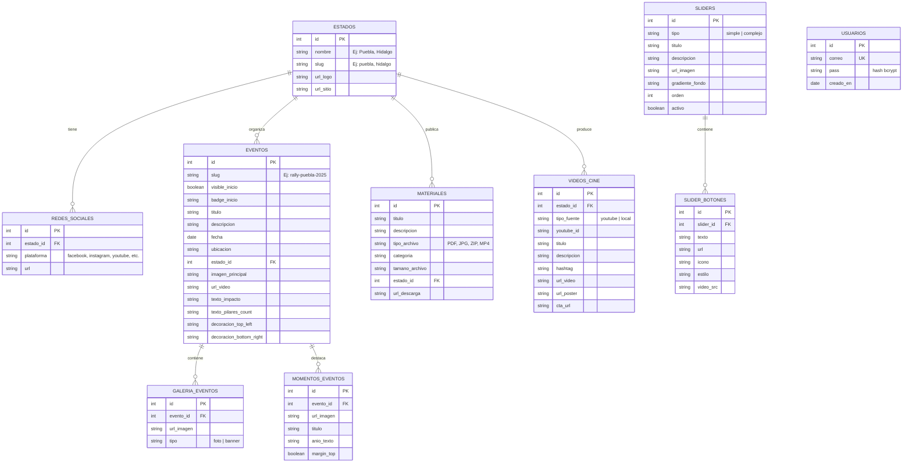

# Diagrama de Base de Datos - Integridad desde la Raíz

Este documento describe el esquema de base de datos relacional propuesto para la aplicación, basado en las estructuras de datos actuales (JSON) y las necesidades funcionales de cada página (`cine.html`, `eventos.html`, `material.html`, `index.html`).

## Diagrama Entidad-Relación (Mermaid)

## Diccionario de Datos

### 1. Entidades Principales

#### `ESTADOS` (Estados)
Catálogo de estados participantes en el proyecto.
- **id**: Identificador único.
- **nombre**: Nombre legible (Ej: "Puebla").
- **slug**: Identificador para URLs y filtros (Ej: "puebla").
- **url_logo / url_sitio**: Datos para la barra de estados en Inicio.

#### `USUARIOS` (Acceso al Admin)
Tabla usada por el login de administración (`login.php`).
- **correo**: Identificador único (usuario).
- **pass**: Hash con `password_hash()` (verifica con `password_verify()`).

#### `VIDEOS_CINE` (Cine)
Unifica los datos de:
- **Inicio (index.html)**: tarjetas por estado con video local + poster.
- **cine.html**: listado de videos YouTube filtrable por estado.

Campos clave:
- **tipo_fuente**: `local` o `youtube`.
- **youtube_id**: Solo si `tipo_fuente = youtube`.
- **url_video / url_poster**: Solo si `tipo_fuente = local`.
- **estado_id**: Relación con el estado.

#### `EVENTOS` (Eventos)
Unifica los datos de:
- **Inicio (index.html)**: “Último Evento” (usa `visible_inicio` y `badge_inicio`).
- **eventos.html + detalle_evento.html**: listado y detalle.

Campos clave:
- **slug**: Identificador estable usado en `detalle_evento.html?id=<slug>`.
- **texto_impacto / texto_pilares_count**: métricas que se muestran en el detalle.

### 2. Tablas Auxiliares de Eventos
Para normalizar listas:
- **`GALERIA_EVENTOS`**: Fotos del evento y/o banners roll-up, diferenciados por `tipo` (`foto` / `banner`).
- **`MOMENTOS_EVENTOS`**: Galería “Momentos Inolvidables” (título/año/imagen) que hoy existe como dataset adicional.

#### `MATERIALES` (Materiales)
Repositorio de archivos descargables en `material.html`.
- **tipo_archivo**: Tipo de archivo para mostrar badges correctos.
- **tamano_archivo**: Texto libre (Ej: `4.2 MB`).
- **url_descarga**: Ruta/URL del archivo.

#### `SLIDERS` (Inicio)
Controla los slides del carrusel en `index.html` (con botones en `SLIDER_BOTONES`).
- **orden**: Para ordenar la secuencia de los slides.
- **gradiente_fondo**: Permite fondos personalizados o degradados complejos.
- **activo**: Habilita/deshabilita el slide sin borrarlo.
