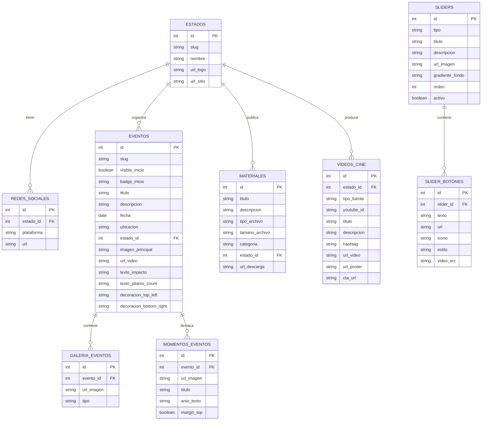

# Código para Diagramas

## 1. Mapa del Sitio (Estructura Detallada con Filtros)

```mermaid
graph TD
    subgraph SITE [Sitio Web: Integridad desde la Raíz]
        direction TB
        
        INICIO[Página de Inicio (index.html)]
        CINE_SECCION[Página Cine (cine.html)]
        EVENTOS_SECCION[Página Eventos (eventos.html)]
        DETALLE_EVENTO[Página Detalle (detalle_evento.html)]
        
        INICIO --> SLIDER_CONTENEDOR[Contenedor del Slider]
        INICIO --> ESTADOS_CONTENEDOR[Contenedor de Estados]
        INICIO --> CINE_PREVIEW[Sección Cine (vista previa por estado)]
        INICIO --> ULTIMO_EVENTO[Sección Último Evento]
        
        CINE_SECCION -- "Filtro por query ?estado=estado_slug" --> CINE_LISTADO[Listado de videos (YouTube)]
        EVENTOS_SECCION --> EVENTOS_LISTADO[Listado paginado]
        EVENTOS_LISTADO --> DETALLE_EVENTO
        DETALLE_EVENTO -- "Carga por query ?id=evento_id" --> EVENTO_DETALLE[Evento seleccionado]
        ULTIMO_EVENTO -- "Toma el primer visible:true" --> EVENTO_ACTIVO[Evento activo en Inicio]
    end

    subgraph SLIDER_DETALLE [Detalle: Contenido del Slider]
        direction LR
        SLIDER_CONTENEDOR --> SLIDER_ITEM{Slide}
        SLIDER_ITEM --> SLIDER_TIPO{Tipo: simple o complex}
        SLIDER_ITEM --> SLIDER_FONDO[Fondo/Imagen]
        SLIDER_ITEM --> SLIDER_TEXTOS[Textos: Título, Badge, Descripción]
        SLIDER_ITEM --> SLIDER_BOTONES[Botones]
    end

    subgraph ESTADOS_DETALLE [Detalle: Contenido de Estados]
        direction LR
        ESTADOS_CONTENEDOR --> ESTADO_ITEM{Estado}
        ESTADO_ITEM --> ESTADO_INFO[Logo e Info del Estado]
        ESTADO_ITEM --> ESTADO_REDES[Redes Sociales]
    end

    subgraph CINE_DETALLE [Detalle: Contenido de Cine (Inicio vs Página)]
        direction LR
        CINE_PREVIEW --> CINE_ESTADO_ITEM{Tarjeta por estado}
        CINE_ESTADO_ITEM --> CINE_ESTADO_INFO[Nombre, slogan, color]
        CINE_ESTADO_ITEM --> CINE_ESTADO_MEDIA[Video local (.mp4) + poster]
        CINE_LISTADO --> CINE_VIDEO_ITEM{Video}
        CINE_VIDEO_ITEM --> CINE_VIDEO_INFO[Título, descripción, hashtag]
        CINE_VIDEO_ITEM --> CINE_VIDEO_ESTADO[Estado (badge + color)]
    end

    subgraph EVENTOS_DETALLE [Detalle: Contenido de Eventos]
        direction LR
        EVENTO_ACTIVO --> EVENTO_INFO_INICIO[Info básica: badge, título, fecha, ubicación]
        EVENTO_ACTIVO --> EVENTO_IMAGEN_INICIO[Imagen principal + decoraciones + galería]
        EVENTO_DETALLE --> EVENTO_INFO_DETALLE[Info: título, fecha, ubicación, descripción]
        EVENTO_DETALLE --> EVENTO_METRICAS[Impacto + pilares_count]
        EVENTO_DETALLE --> EVENTO_PILARES[Pilares (texto) o Banners (rollups)]
        EVENTO_DETALLE --> EVENTO_GALERIA[Visor + thumbnails (galería)]
    end

    style SITE fill:#f1f5f9,stroke:#64748b,stroke-width:2px
    style SLIDER_DETALLE fill:#f0fdf4,stroke:#16a34a
    style ESTADOS_DETALLE fill:#f0fdf4,stroke:#16a34a
    style CINE_DETALLE fill:#f0fdf4,stroke:#16a34a
    style EVENTOS_DETALLE fill:#f0fdf4,stroke:#16a34a
```

## 2. Diagrama de Base de Datos (Platzhalter)

Versión propuesta alineada a los campos unificados (Inicio + páginas internas).




